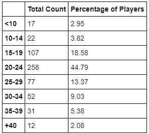
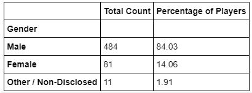
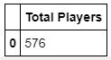

# Heroes of Pymoli
### Summary
This repository contains a Jupyter Notebook with the viewable Data Frames and a written description of observable trends based on the most recent fantasy game: Heroes of Pymoli.
### Technical Details
In order to run the code, it is required the pandas library and Jupyter Notebook. 
### Screenshots
Age.JPG 
  
Gender.JPG 
  
Total.JPG 
  
### Explanations 
The outcome is shown in screenshots for reference purpose of the public. 

# Option 1: Heroes of Pymoli 

Analyse the data for their most recent fantasy game Heroes of Pymoli. 
Like many others in its genre, the game is free-to-play, but players are encouraged to purchase optional items that enhance their playing experience.  
Generate a report that breaks down the game's purchasing data into meaningful insights.  

The final report includes each of the following: 

Player Count 
Total Number of Players 
Purchasing Analysis (Total) 
Number of Unique Items Average Purchase Price Total Number of Purchases Total Revenue 
Gender Demographics 
Percentage and Count of Male Players Percentage and Count of Female Players Percentage and Count of Other / Non-Disclosed 
Purchasing Analysis (Gender) 
The below each broken by gender 
Purchase Count Average Purchase Price Total Purchase Value Average Purchase Total per Person by Gender 
Age Demographics 
The below each broken into bins of 4 years (i.e. <10, 10-14, 15-19, etc.) 
Purchase Count Average Purchase Price Total Purchase Value Average Purchase Total per Person by Age Group 
Top Spenders 
Identify the the top 5 spenders in the game by total purchase value, then list (in a table): 
SN Purchase Count Average Purchase Price Total Purchase Value 
Most Popular Items 

Identify the 5 most popular items by purchase count, then list (in a table): 

Item ID Item Name Purchase Count Item Price Total Purchase Value 
Most Profitable Items 
Identify the 5 most profitable items by total purchase value, then list (in a table): 
Item ID Item Name Purchase Count Item Price Total Purchase Value 
